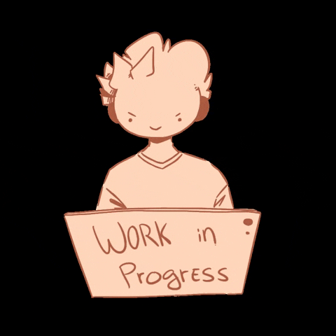

<h3 align="center">Hi 👋! My name is Istiyaq and I'm a Aspiring Computer Science and Engineering student|Passionate about coding, problem-solving, and software development | Eager to learn and contribute to innovative projects.</h3>

###

  <!--  -->
  

###

<h3 align="left">Languages and Tools:</h3>

  
  
  
  
  
  
  <!-- 
  
  
   -->
  <!-- -- commented out for future ref.> -->

<h3 align="left">Connect with me:</h3>

 
  

###

 

<!--  -->

<picture>
  <source media="(prefers-color-scheme: dark)" srcset="https://raw.githubusercontent.com/platane/platane/output/github-contribution-grid-snake-dark.svg">
  <source media="(prefers-color-scheme: light)" srcset="https://raw.githubusercontent.com/platane/platane/output/github-contribution-grid-snake.svg">
  
</picture>

<!-- _generated with [Platane/snk](https://github.com/Platane/snk)_ -->

###
